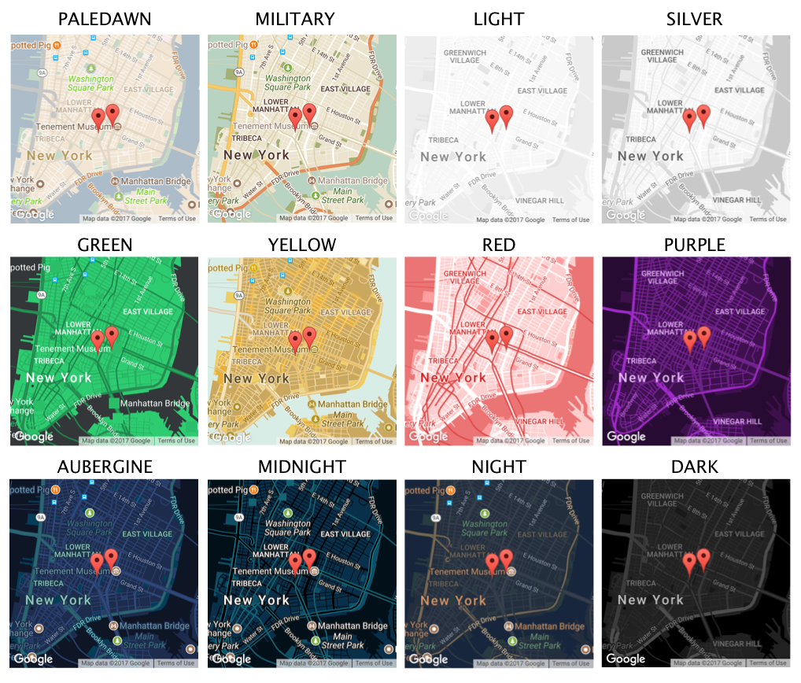

<p align="center"></p>

## IonMaps
It's a simple set of components to help ease the development process when using google maps with Ionic.

### Dependencies
In order to run this project properly, you have to install the native maps plugin as such:

```bash
$ ionic cordova plugin add cordova-plugin-googlemaps --variable API_KEY_FOR_ANDROID="YourApiKeyHere" --variable API_KEY_FOR_IOS="YourKeyApiHere" --variable LOCATION_WHEN_IN_USE_DESCRIPTION="Show your location on the map" --variable LOCATION_ALWAYS_USAGE_DESCRIPTION="Trace your location on the map"
$ npm install --save @ionic-native/google-maps
```

If you run into any issues such as not finding `google` definition, run:

```bash
npm install --save @types/googlemaps
```

## Components

### Ion Maps

 It's a component that renders the best possible google map on the device, depending on what platforms it's running on. If on web, it will use javascript google maps, if on a native device, it will use native google maps.

| Property     | Type     | Definition             |
|-----------------|------------------|---------------------------------------|
| lat | string | Latitude position of the map. *Required*|
| lng | string | Longitude position of the map. *Required* |
| height | string | Height of the element. Can be used in %, px, em, rem. Defaults to '100%' |
| width | string | Width of the element. Can be used in %, px, em, rem. Defaults to '100%' |
| zoom | number | Initial zoom of the map. Defaults to 15 |
| tilt | number | Initial tilt of the map. |
| mapStyle | string or json | Theme of the map. Possible values: `standard`, `silver`, `light`, `dark`, `night`, `midnight`, `aubergine`, `military`, `paledawn`, `red`, `purple`, `green`, `yellow`. You can also pass a custom style json object with your own custom properties.  Defaults to `standard`. |
| showGeolocation | boolean | Whether or not to show a pulsating dot in your geolocation. Defaults to false. |

***Usage***
ps: The component can be used with or without markers.

```html
<ion-content>
  <ion-maps mapStyle="military" lat="40.714728" lng="-73.998672">
    <!--Normal marker-->
    <ion-marker lat="40.718417" lng="-73.996734" label="Y" title="Normal Marker"></ion-marker>

    <!--Custom icon marker-->
    <ion-marker lat="40.718217" lng="-73.991434" title="Custom icon" iconUrl="http://icons.iconarchive.com/icons/paomedia/small-n-flat/48/map-marker-icon.png"></ion-marker>

    <!--Custom HTML marker-->
    <ion-marker lat="40.717317" lng="-73.995284" parentClass="custom-marker-outer" customHTML="<div class='custom-marker-inner'></div>"></ion-marker>
  </ion-maps>

  <!-- Or without markers -->
  <ion-maps lat="40.714728" lng="-73.998672"></ion-maps>
  
<ion-content>
```

### Ion Static Maps

Renders a static for moments where you need a fast rendered page that doesn't need map interaction.

| Property     | Type     | Definition             |
|-----------------|------------------|---------------------------------------|
| lat | string |Latitude position of the map. Required if not using address. |
| lng | string | Longitude position of the map. Required if not using address.  |
| address | string | Address position of the map. Can be a search string such as `New York Street, 129.` Ignored if lat lng is also passed. |
| height | number | Height of the element in px. Defaults to 400px |
| width | number | Width of the element. Defaults to 400px |
| zoom | number | Initial zoom of the map. Defaults to 15 |
| format | string | Image format of the generated map. Possible values: `png`, `jpeg`, `gif`. Defaults to `png`.|
| language | string | Language of the map labels. Only works in certain countries. |
| mapType | string | Type of the map. Possible values: HYBRID, ROADMAP, SATELLITE and TERRAIN. |
| mapStyle | string or json | Theme of the map. Possible values: `standard`, `silver`, `light`, `dark`, `night`, `midnight`, `aubergine`, `military`, `paledawn`, `red`, `purple`, `green`, `yellow`. You can also pass a custom style json object with your own custom properties. Defaults to `standard`. |

***Usage***
ps: The component can be used with or without markers.

```html
<ion-content>
  <ion-static-maps mapStyle="silver" lat="40.714728" lng="-73.998672">
     <!--Normal marker-->
    <ion-marker lat="40.718417" lng="-73.996734" color="yellow" label="Y"></ion-marker>

    <!--Custom icon marker-->
    <ion-marker lat="40.718217" lng="-73.991434" iconUrl="http://icons.iconarchive.com/icons/paomedia/small-n-flat/48/map-marker-icon.png"></ion-marker>
  </ion-static-maps>

  <!-- Or without markers -->
  <ion-static-maps lat="40.714728" lng="-73.998672"></ion-static-maps>
</ion-content>
```

### Ion Marker
Note that this component can be used with both `<ion-maps>` and `<ion-static-maps>`.

| Property     | Type     | Definition             |
|-----------------|------------------|---------------------------------------|
| lat | string | Latitude position of the marker. Required if not using address. |
| lng | string | Longitude position of the marker. Required if not using address.  |
| address | string | Address position of the marker. Can be a search string such as `New York Street, 129.` Ignored if lat lng is also passed. |
| title | string | Title of the marker. *Only works on ion-maps* |
| label | string | Label of the marker. Single letter that appears on the pin. Ignored if using iconUrl. |
| iconUrl | string | Url for an icon that will be displayed as a pin. Works with small sized png and ico files. |
| color | string | Color of the pin. *Only works on ion-static-maps*. Possible values: `yellow`, `red`, `green`, `blue`, `purple`, `orange`, `green` or any hex color in 0xRRGGBB format. |
| draggable | boolean | If true, the marker will have a DROP animation on the screen. Default value is false. |
| animated | boolean | If true, the marker dropped with an animation to the map. Default value is false. |
| visible | boolean | If true, the marker visible in the map. Default value is false. |
| opacity | number | Marker's opacity between 0.0 and 1.0. *Only works with javascript maps*. Defaults to 1. |
| zIndex | number | zIndex of the marker. Defaults to 1. |
| customHTML | string | HTML to compose a custom marker element. *Only works on javascript maps.*|
| parentClass | string | Class or classes to be added on the parent div of a customHTML marker element. Use it along with `customHTML`, but not required. |

### Styling

As stated above, both `ion-maps` and `ion-static-maps` accept a property named `mapStyle`. It takes either a string with a name of a predefined style, or a custom style object, of which you can get on [Maps Style Wizard](https://mapstyle.withgoogle.com/) or [Snazzy Maps](https://snazzymaps.com/).

If you don't use this param, the map will be rendered with default styles. In case you choose to use one of the presets, this is what the map is going to look like:
<p align="center"></p>
